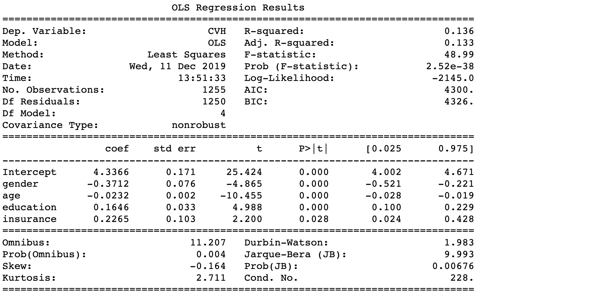
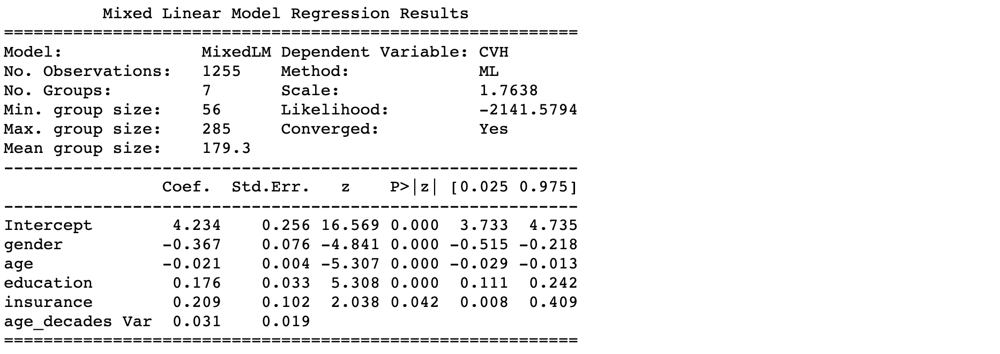

## Introduction
##### Cardiovascular health is one of the greatest health problems across the entire globe. Overall, heart disease, is the No. 1 killer in the United States. Therefore, it is interesting to see if gender have an impact on cardiovascular health.
##### It is known that there are seven index variables that determine the cardiovascular health (CVH). Smoking, BMI, Physical Activity, Diet, Blood Cholesterol, and Health Insurance. Each of the seven index variables is modified into a binary variable, CVH score is calcuated by taking the sum of these seven variables.

## Data
##### The data sets we used in this analysis are from the NHANES (National Health and Nutrition Examination Survey) in from year 2005 - 2006. 

#### Index Variables used to compute CVH scores:
| Variables      | Description                                           | Dataset  |
|----------------|-------------------------------------------------------|----------|
| BMI            | Body Mass Index                                       | BMX_D    |
| Diet           | How healthy is the diet                               | DBQ_D    |
| Smoking        | Smoked at least 100 cigarettes in life                | SMQ_D    |
| Glucose        | Fasting blood glucose (<=100 mg/dL is normal)         | GLU_D    |
| Activity       | Physical Activity level multiply the duration of time | PAQIAF_D |
| Cholesterol    | Total blood cholesterol (<200 mg/dL is normal)        | TCHOL_D  |
| Blood Pressure | Mean systolic <120mm and diastolic <80 is normal      | BPX_D    |s

#### Control Variables:
| Variables        | Level             | Description (respectively)                                                                       | Dataset |
|------------------|-------------------|--------------------------------------------------------------------------------------------------|---------|
| Age              | 1,2,3,4,5,6,7,8,9 | Each number represents a decade starting 0-10                                                    | DEMO_D  |
| Race             | 1,2,3,4,5         | Mexican, Other Hispanic, Non-Hispanic White, Non-Hispanic Black, Other                           | DEMO_D  |
| Gender           | 0,1               | Female, Male                                                                                     | DEMO_D  |
| Education        | 1,2,3,4,5         | Less Than 9th Grade, 9-11th Grade, High School Grad/GED, Some College, College Graduate or above | DEMO_D  |
| Health Insurance | 0,1               | With, Without                                                                                    | HIQ_D   |

## Methods
##### We first use 7 binary index variables to calculate the score (range 0-7) of CVH. Next, start with a simple indicator-by-indicator comparison to assess prevalence of ideal CVH(scored 6-7) among female and male using standard logistic regression. In other words, first regressing each indicator of CVH against gender (and control variables) one at a time. Then, we use the ordinary least squares to fit all the variables. By examing the significance of each variable, we decide to take out race since it has a very large p-value. After reducing to four variables, we fit the linear model again and re-examine the significance level of our variables. However, linear model is not sufficient to get the result. We decided to take a step further applying mixed linear model. In order to see the differences among groups, we drew boxplots on each of the variables after the variable selection by CVH scores.

##### Liniear models and Linear Mixed effects models in Python, R and Stata

## Core Analysis {.tabset .tabset-fade}
### Python

```{r setup, include=FALSE}
knitr::opts_chunk$set(echo = TRUE)
```

#### Data visualization


##### Logistic regression on each indicator
```{python eval=FALSE}
df.exog = sm.add_constant(df[["gender", "age", "race", "education", "insurance"]])
params = []; pvalues = []
for col in y_cols:
    glm = sm.GLM(df[col], df.exog,  
                 family = sm.families.Binomial()).fit()
    #print(glm.summary())
    params.append(glm.params['gender'])
    pvalues.append(glm.pvalues['gender'])
```

```{python eval=FALSE}
single_logit = pd.DataFrame(data = {'Coeffcient': params, 'p-value': pvalues},
                            index = y_cols)
single_logit['significance'] = single_logit['p-value']<=0.05
single_logit
```

#### Linear models on the response CVH

##### Linear regression model

```{python eval=FALSE}
# basic linear model OLS
ols = sm.OLS.from_formula(formula = 'CVH ~ gender + age + race + education + insurance', data = df).fit()
print(ols.summary())
```


From the basic linear regression model above, we find all other variables are significant except for variable **"race"** with p-value=0.886.

Therefore, we adopt backward elimination based on the p-values from the regression summary above by removing variable **"race"** from our linear regression model, and we can see that our model has all variables that  are siginificant.

```{python eval=FALSE}
# OLS with simple backward elimination - deletes 'race'
ols_elim = sm.OLS.from_formula(formula = 'CVH ~ gender + age + education + insurance', data = df).fit()
print(ols_elim.summary())
```



From the second regression summary above, we can see that all four variables in the model are significant and a slight decrease of AIC and BIC criterion. In additon, due to benefit of simplicity, we will adopt this model.

#####  Linear mixed effects model

```{python eval=FALSE}
mixedlm = sm.MixedLM.from_formula("CVH ~ gender + age + education + insurance", groups="age_decades", data=df).fit()
print(mixedlm.summary())
```



### R

```{r message=FALSE, warning=FALSE, include=FALSE, paged.print=FALSE}
# Loading packages needed in following steps
library("tidyverse")
library(haven)
library(dplyr)
library(tidyr)
library(ResourceSelection)
library(ggplot2)
library(foreign)#
library(nnet)#
library(ggplot2)
library(reshape2)
library(lmerTest)
library(car)
library(nlme)
multiplot <- function(..., plotlist=NULL, file, cols=1, layout=NULL) {
  ## A function used to plot several plots on the same page.
  ## found this func from internet
  ## input: ggplot item
  ## output: just plot
  
  require(grid)
  
  # Make a list from the ... arguments and plotlist
  plots <- c(list(...), plotlist)
  
  numPlots = length(plots)
  
  # If layout is NULL, then use 'cols' to determine layout
  if (is.null(layout)) {
    # Make the panel
    # ncol: Number of columns of plots
    # nrow: Number of rows needed, calculated from # of cols
    layout <- matrix(seq(1, cols * ceiling(numPlots/cols)),
                     ncol = cols, nrow = ceiling(numPlots/cols))
  }
  
  if (numPlots==1) {
    print(plots[[1]])
    
  } else {
    # Set up the page
    grid.newpage()
    pushViewport(viewport(layout = grid.layout(nrow(layout), ncol(layout))))
    
    # Make each plot, in the correct location
    for (i in 1:numPlots) {
      # Get the i,j matrix positions of the regions that contain this subplot
      matchidx <- as.data.frame(which(layout == i, arr.ind = TRUE))
      
      print(plots[[i]], vp = viewport(layout.pos.row = matchidx$row,
                                      layout.pos.col = matchidx$col))
    }
  }
}
```

We first process the data before fitting a model.
```{r echo=FALSE, message=FALSE, warning=FALSE}
library(MASS)
detach("package:MASS", unload=TRUE)
# Load data and select variables we need and drop NA
X<-read_xpt("https://wwwn.cdc.gov/Nchs/Nhanes/2005-2006/DEMO_D.XPT")
X_variable<-X%>%select("SEQN","RIAGENDR","RIDAGEYR","DMDEDUC2","RIDRETH1")%>%
  drop_na()%>%
  filter(RIDAGEYR>=20,DMDEDUC2!=7,DMDEDUC2!=9)%>%
  mutate(RIAGENDR=as.numeric(RIAGENDR==1))%>%
  transmute(SEQN,gender=RIAGENDR,age=RIDAGEYR,race=RIDRETH1,education=DMDEDUC2)
health_insurance<-read_xpt("https://wwwn.cdc.gov/Nchs/Nhanes/2005-2006/HIQ_D.XPT")
health_insurance<-health_insurance%>%select(SEQN,HIQ011)%>%
  drop_na()%>%
  filter(HIQ011!=7,HIQ011!=9)%>%
  mutate(insurance=as.numeric(HIQ011==1))%>%
  select(SEQN,insurance)
Smoking<-read_xpt("https://wwwn.cdc.gov/Nchs/Nhanes/2005-2006/SMQ_D.XPT")
Smoking<-Smoking%>%
  select(SEQN,SMQ020)%>%
  drop_na()%>%
  filter(SMQ020<7)%>%
  mutate(smoking=as.numeric(SMQ020!=1))%>%
  select(SEQN,smoking)
BMI<-read_xpt("https://wwwn.cdc.gov/Nchs/Nhanes/2005-2006/BMX_D.XPT")
BMI<-BMI%>%select(SEQN,BMXBMI)%>%
  drop_na()%>%
  mutate(BMI=as.numeric(BMXBMI>=18.5&BMXBMI<=24.9))%>%
  select(SEQN,BMI)
Blood_pressure<-read_xpt("https://wwwn.cdc.gov/Nchs/Nhanes/2005-2006/BPX_D.XPT")
Blood_pressure<-Blood_pressure%>%select(SEQN,BPXSY1,BPXSY2,BPXSY3,BPXDI1,BPXDI2,BPXDI3)%>%
  gather(condition, BPX, BPXSY1:BPXDI3)%>%
  mutate(condition=substring(condition,1,5))%>%
  group_by(SEQN,condition)%>%
  summarise(BPX=mean(BPX,na.rm=T))%>%
  ungroup()%>%
  spread(condition,BPX)%>%
  drop_na()%>%
  filter(BPXDI!=0,BPXSY!=0)%>%
  transmute(SEQN,Blood_pressure=as.numeric((BPXDI<80)&(BPXSY<120)))
Diet_raw<-read_xpt("https://wwwn.cdc.gov/Nchs/Nhanes/2005-2006/DBQ_D.XPT")
Diet<-Diet_raw%>%select(SEQN,DBQ700)%>%
  drop_na()%>%
  filter(DBQ700!=7,DBQ700!=9)%>%
  transmute(SEQN,Diet=as.numeric(DBQ700<=3))
Diet_alt<-Diet_raw%>%
  select(SEQN,DBQ780)%>%
  drop_na()%>%
  filter(DBQ780!=77,DBQ780!=99)%>%
  transmute(SEQN,Diet=as.numeric(DBQ780<=4))
Physical_Activity<-read_xpt("https://wwwn.cdc.gov/Nchs/Nhanes/2005-2006/PAQIAF_D.XPT")
Physical_Activity<-Physical_Activity%>%
  select(SEQN,PADLEVEL,PADTIMES,PADDURAT)%>%
  drop_na()%>%
  mutate(times=PADTIMES*PADDURAT*PADLEVEL)%>%
  group_by(SEQN)%>%
  summarise(phy_act=as.numeric(sum(times)>=600))%>%
  select(SEQN,phy_act)
Blood_Cholesterol<-read_xpt("https://wwwn.cdc.gov/Nchs/Nhanes/2005-2006/TCHOL_D.XPT")
Blood_Cholesterol<-Blood_Cholesterol%>%
  select(SEQN,LBXTC)%>%
  drop_na()%>%
  transmute(SEQN,blood_cho=as.numeric(LBXTC<200))
Blood_Glucose<-read_xpt("https://wwwn.cdc.gov/Nchs/Nhanes/2005-2006/GLU_D.XPT")
Blood_Glucose<-Blood_Glucose%>%
  select(SEQN,LBXGLU)%>%
  drop_na()%>%
  transmute(SEQN,blood_glu=as.numeric(LBXGLU<=100))
# merge all seperate datasets together by SEQN
raw_data<-X_variable%>%inner_join(health_insurance, by = "SEQN")%>%
  inner_join(Smoking, by = "SEQN")%>%
  inner_join(BMI, by = "SEQN")%>%
  inner_join(Blood_pressure, by = "SEQN")%>%
  inner_join(Diet, by = "SEQN")%>%
  inner_join(Physical_Activity, by = "SEQN")%>%
  inner_join(Blood_Cholesterol, by = "SEQN")%>%
  inner_join(Blood_Glucose, by = "SEQN")
data<-raw_data%>%transmute(SEQN,CVH=smoking+Blood_pressure+phy_act+blood_cho+blood_glu+BMI+Diet,smoking,Blood_pressure,phy_act,blood_cho,blood_glu,BMI,Diet,gender,age,race,education,insurance)
# Then we get our final version dataset
data
```
#### Data Summary
Here is a description of our data
```{r}
```

To find out more about the relationship between variables, We also polt box plots for response variable CVH grouped by different predictors. (Here we group age variable)
```{r echo=FALSE}
data$age_group=ceiling(data$age/10)-3
data$age_group[data$age_group==-1]=0
p1<-qplot(factor(gender), CVH, 
      colour = factor(gender), geom = "boxplot", data = data)
p2<-qplot(factor(insurance), CVH, 
      colour = factor(insurance), geom = "boxplot", data = data)
p3<-qplot(factor(education), CVH, 
      colour = factor(education), geom = "boxplot", data = data)
p4<-qplot(factor(age_group), CVH, 
      colour = factor(age_group), geom = "boxplot", data = data)
p5<-qplot(factor(race), CVH, 
      colour = factor(race), geom = "boxplot", data = data)
multiplot(p1, p2, cols=2)
multiplot(p3, p5, cols=2)
multiplot(p4, cols=1)
```


#### Logistic Regression on each indicator seperately
First we analyze the relationship between gender and each indicator of CVH score using logistic model.
```{r message=FALSE, warning=FALSE}
gender_smoking <- summary(glm(smoking~gender+education+age+insurance+race,data=data, family = "binomial"))
gender_BP <-summary(glm(Blood_pressure~gender+education+age+insurance+race,data, family = "binomial"))
gender_phy <- summary(glm(phy_act~gender+education+age+insurance+race,data, family = "binomial"))
gender_BC <- summary(glm(blood_cho~gender+education+age+insurance+race,data, family = "binomial"))
gender_BG <- summary(glm(blood_glu~gender+education+age+insurance+race,data, family = "binomial"))
gender_BMI <- summary(glm(BMI~gender+education+age+insurance+race,data, family = "binomial"))
gender_Diet <- summary(glm(Diet~gender+education+age+insurance+race,data, family = "binomial"))
seperate<-data.frame(factor=c("smoking","Blood_pressure","phy_act","blood_cho","blood_glu","BMI","Diet"),gender_effect=rep(0,7),p_value=rep(0,7),significance=rep("*",7),stringsAsFactors = FALSE)
j=1
for (i in list(gender_smoking,gender_BP,gender_phy,gender_BC,gender_BG,gender_BMI,gender_Diet)){
  seperate$gender_effect[j]=i$coefficients[2,1]
  seperate$p_value[j]=i$coefficients[2,4]
  p=rank(c(i$coefficients[2,4],0.001,0.01,0.05,0.1))[1]
  seperate$significance[j]=switch(p,
                                  "***",
                                  "**",
                                  "*",
                                  ".",
                                  " ")
  j=j+1
}
formattable::formattable(seperate)
```
From the output we can see that gender has significant effect on smoking, Blood_pressure, phy_act, blood_glu. Which means that female is more likely to be non-smoker, have a normal blood pressure, do less healthy physical activity and have normal blood glucose level. This is quite consistent with commen sense.

Then we will treat overall CVH score as continuous variable and conduct some regression analysis to check the relationship between CVH and gender.

#### Fitting an OLS model
We first begin with OLS full model. It is obvious that race is insignificant and we choose to delete this variable. The Box-Cox plot suggests no transformation needed for response. 
```{r message=FALSE, warning=FALSE}
OLS_full<-lm(CVH~gender+race+education+insurance+age,data)
summary(OLS_full)
# R square is still quite small but anyway this model is better than null model based on F test.
OLS_opt<-lm(CVH~gender+education+insurance+age,data)
summary(OLS_opt)
OLS2<-lm(CVH+1~gender+education+insurance+age,data)
library(MASS)
boxcox(OLS2,plotit=T)# 1 is in the confidence interval so no need to do transformation
#dat=data.frame(fitted.values=as.vector(OLS_opt$fitted),residuals=as.vector(OLS_opt$residuals))
#ggplot(data=dat,aes(x=fitted.values,y=residuals))+geom_point(color="red",alpha=0.1)+geom_smooth(se=T)
```

#### Mixed Effect Model 
Back to our box plots,we can see that the CVH shows difference in different age groups. It is resasonable to establish the following mixed effect model. 
```{r}
mixed=lme(CVH~gender+insurance+age+education, random=~1|education+1|age_group,  
         method = 'ML', data = data)
summary(mixed)
```
Conduct Analysis of Variance and we find this model significant. We draw the residuals-fitted plot. The line looks flat, the residuals and fitted values seems to be less irrelevant compared to the OLS model. Then we test whether random effects are warranted:
```{r message=FALSE, warning=FALSE}
Anova(mixed)
dat=data.frame(fitted.values=as.vector(fitted(mixed)),residuals=as.vector(residuals(mixed)))
ggplot(data=dat,aes(x=fitted.values,y=residuals))+geom_point(color="red",alpha=0.1)+geom_smooth(se=T)
```

```{r eval=FALSE, include=FALSE}
# lm.test
dev1 = -2*logLik(mixed);dev0 = -2*logLik(OLS_opt)
devdiff = as.numeric(dev0-dev1)
dfdiff <- attr(dev1,"df")-attr(dev0,"df"); 
cat('Chi-square =', devdiff, '(df=', dfdiff,'), p =', 
    pchisq(devdiff,dfdiff,lower.tail=FALSE))
```
We test the random effects in the model by comparing the model to a model fitted with just the fixed effects and excluding the random effects. 
```{r}
model.fixed = gls(CVH~gender+insurance+age+education,
                  data=data,
                  method="ML")
anova(model.fixed,mixed)
```
From the p value for likelihood ratio test and the comparision of AIC, BIC and loglik, we can conclude that the random effects are significant since this mixed model is significantly different from the OLS model. It has smaller AIC and BIC, and larger logLik. 


To conclude, factors related to a favorable CVH score included insurance covered, younger age, female sex, and a higher level of education.

So the answer to the question we brought up is yes, women tend to have a better cardiovascular health condition than men in the US. 

### Stata

#### After the final dataset was cleaned, using 'logistic' command in stata to fit a logistic regression on each index variable against Gender, Education, Age, Insurance, and Race.
```{r logistic, eval=FALSE}
use M:\group_project_data.dta 
logistic smoking i.gender i.edu i.age_factor i.insurance i.race 
logistic bp i.gender i.edu i.age_factor i.insurance i.race 
logistic activity i.gender i.edu i.age_factor i.insurance i.race 
logistic cholesterol i.gender i.edu i.age_factor i.insurance i.race 
logistic glucose i.gender i.edu i.age_factor i.insurance i.race 
logistic bmi i.gender i.edu i.age_factor i.insurance i.race 
logistic diet i.gender i.edu i.age_factor i.insurance i.race
```

#### Using Ordinary Least Squares to see the significance of each variable and fit another OLS after variable selection.
```{r ols, eval=FALSE}
regress cvh gender age_factor race edu insurance 
regress cvh gender age_factor edu insurance
```
{width=500px}

```{r boxplots, eval=FALSE}
graph box cvh, over(gender) title("Box plot for Gender", span)
graph box cvh, over(edu) title("Box plot for Education", span)
graph box cvh, over(insurance) title("Box plot for Insurance", span)
graph box cvh, over(age_factor) title("Box plot for Age", span)
```

```{r mixed, eval=FALSE}
mixed cvh i.gender i.insurance c.age c.edu ||_all:R.age_factor
```

#### Data Visualization
{width=350px}
{width=350px}
{width=350px}
{width=350px}

## Results