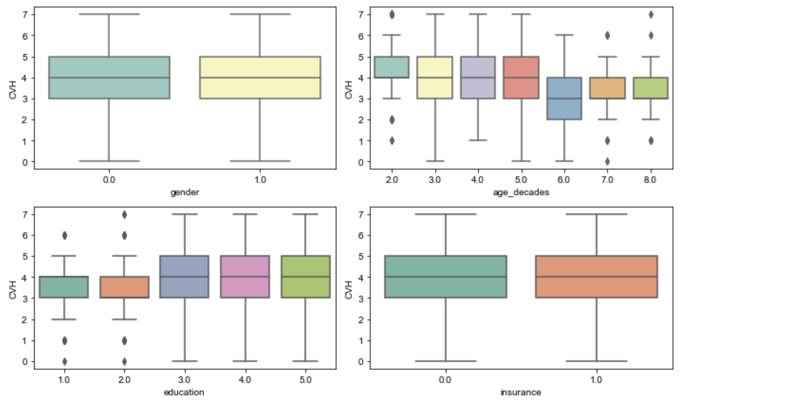
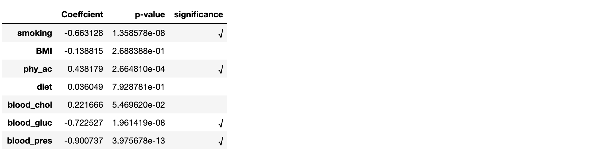
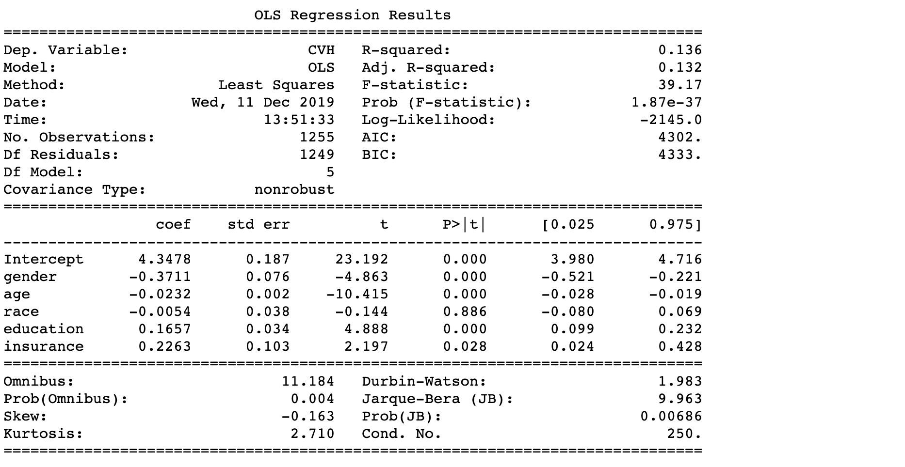

## Introduction

Cardiovascular health (CVH) is one of the greatest health problems across the entire globe. Overall, heart disease, is the No. 1 killer in the United States. Therefore, it is interesting to see if gender have an impact on cardiovascular health.

The American Heart Association defined a new concept as *Cardiovascular Health*, which is determined by the presence of 7 metrics: smoking, body mass index (BMI), physical activity, diet, blood cholesterol, blood glucose and blood pressure.

We will first investigate whether gender causes an effect on each of the seven metrics of cardiovascular health, and then combining them into one model, analyze the impact of gender on the overall cardiovascular health.


## Data

The datasets we used in this analysis are from the NHANES (National Health and Nutrition Examination Survey) from year [2005 - 2006](https://wwwn.cdc.gov/nchs/nhanes/ContinuousNhanes/Default.aspx?BeginYear=2005).


#### Response Variable:

In our analysis, each of the seven metrics of cardiovascular health is treated as a binary variable, taking the value of 1 when one meets the criterion while 0 when one does not. CVH score is calculated by taking the sum of these seven binary variables which is shown in the table below.

| Response           	| Criteria                                                                             	| Datasets 	| Variable Names                                             	|
|-------------------	|--------------------------------------------------------------------------------------	|----------	|------------------------------------------------------------	|
| smoking           	| Smoked less than 100 cigarettes in life.                                             	| SMQ_D    	| SMQ020                                                     	|
| BMI               	| Body mass index between 18.5 and 24.9 inclusive.                                     	| BMX_D    	| BMXBMI                                                     	|
| physical activity 	| At least 600-minute moderate (or 300-minute vigorous) exercises in the past 30 days. 	| PAQIAF_D 	| PADLEVEL, PADTIMES, PADDURAT                               	|
| diet              	| Overall diet is considered healthy by the survey participant.                        	| DBQ_D    	| DBQ700                                                     	|
| blood cholesterol 	| Total cholesterol <200 mg/dL.                                                        	| TCHOL_D  	| LBXTC                                                      	|
| blood glucose     	| Fasting blood glucose ≤100 mg/dL.                                                    	| GLU_D    	| LBXGLU                                                     	|
| blood pressure    	| Ideal blood pressure is <120/80 mm Hg.                                               	| BPX_D    	| BPXSY1,BPXDI1, BPXSY2,BPXDI2, BPXSY3,BPXDI3, BPXSY4,BPXDI4 	|
| CVH               	| Overall CVH score by summing up the seven binary variable above.                        	|          	|                                                            	|


#### Predictor Variables:

Our analysis focuses on survey participants aged over 20 years old and retrieves their basic demographic characteristics including gender, age, race, level of education and health insurance status. Gender is our main factor of interest while other variables are covariates that help build and illustrate our model.


| Predictors 	| Value/Level 	| Description  	| Dataset 	| Variable 	|
|------------------	|-----------------	|--------------------------------------------------------------------------------------------------	|---------	|----------	|
| gender 	| {0, 1} 	| Female, Male 	| DEMO_D 	| RIAGENDR 	|
| age 	| [20, 85] 	| Age 	| DEMO_D 	| RIDAGEYR 	|
| race 	| {1, 2, 3, 4, 5} 	| Mexican, Other Hispanic, Non-Hispanic White, Non-Hispanic 	| DEMO_D 	| RIDRETH1 	|
| education 	| {1, 2, 3, 4, 5} 	| Less Than 9th Grade, 9-11th Grade, High School Grad/GED, Some College, College Graduate or above 	| DEMO_D 	| DMDEDUC2 	|
| insurance 	| {0, 1} 	| With health insurance, Without health insurance 	| HIQ_D 	| HIQ011 	|


## Methods

Regression models are adopted in the whole analysis, which is a powerful and popular statistical tool in assessing the relationship between predictor variables and response variables. Our analysis consists of two major parts which differs from each other in the response variables that we look into in the regression model. 

1. The first part is indicator-by-indicator logistic regression models. Since there are seven metrics for cardiovascular health, we regress each indicator (binary variable) of CVH against gender and control variables, and make a comparison of the significance of gender among these seven models.

    In the logistic regression model, we have the binary response variable $Y_{smoking}$, and predictor variable`gender`, `age`, `race`, `education` and `insurance`, so we fit a model of $p_{smoking} = P(Y_{smoking}=1)$ against all five predictors, whose formula can be given as
    $$ \log\frac{p_{smoking}}{1-p_{smoking}} = \beta_0 + \beta_1 X_{gender} + \beta_2 X_{age} + \beta_3 X_{race} + \beta_4 X_{education} + \beta_5 X_{insurance} $$

    Similarly, for the other six binary response variable, the corresponding logistic formulas are
    $$ \log\frac{p_{bmi}}{1-p_{bmi}} = \beta_0 + \beta_1 X_{gender} + \beta_2 X_{age} + \beta_3 X_{race} + \beta_4 X_{education} + \beta_5 X_{insurance} $$
    $$ \log\frac{p_{physical\_activity}}{1-p_{physical\_activity}} = \beta_0 + \beta_1 X_{gender} + \beta_2 X_{age} + \beta_3 X_{race} + \beta_4 X_{education} + \beta_5 X_{insurance} $$
    $$ \log\frac{p_{diet}}{1-p_{diet}} = \beta_0 + \beta_1 X_{gender} + \beta_2 X_{age} + \beta_3 X_{race} + \beta_4 X_{education} + \beta_5 X_{insurance} $$
    $$ \log\frac{p_{blood\_cholesterol}}{1-p_{blood\_cholesterol}} = \beta_0 + \beta_1 X_{gender} + \beta_2 X_{age} + \beta_3 X_{race} + \beta_4 X_{education} + \beta_5 X_{insurance} $$
    $$ \log\frac{p_{blood\_glucose}}{1-p_{blood\_glucose}} = \beta_0 + \beta_1 X_{gender} + \beta_2 X_{age} + \beta_3 X_{race} + \beta_4 X_{education} + \beta_5 X_{insurance} $$
    $$ \log\frac{p_{blood\_pressure}}{1-p_{blood\_pressure}} = \beta_0 + \beta_1 X_{gender} + \beta_2 X_{age} + \beta_3 X_{race} + \beta_4 X_{education} + \beta_5 X_{insurance} $$


2. The second part concerns with gender’s effect on the expected CVH scores by adopting several regression models, from multiple linear regression to linear mixed model. Precisely, we first use the ordinary least squares criterion to fit a multiple linear regression model on all predictor variables. By examining the significance of each variable, we decide to take out `race` since it has a very large p-value. After reducing to four variables, we fit the linear model again and re-examine the significance level of our variables. However, linear model is not sufficient to get the result. We decided to take a step further applying mixed linear model. In order to see the differences among groups, we drew boxplots on each of the variables after the variable selection by expected CVH scores.

    The multiple linear regression is expressed as
    $$ \text{CVH} = \beta_0 + \beta_1 X_{gender} + \beta_2 X_{age} + \beta_3 X_{race} + \beta_4 X_{education} + \beta_5 X_{insurance}  $$
    With backward elimination, the reduced linear model is
    $$ \text{CVH} = \beta_0 + \beta_1 X_{gender} + \beta_2 X_{age} + \beta_3 X_{education} + \beta_4 X_{insurance}  $$
    Linear mixed model is carried out as
    $$ \text{CVH}_j = \beta_0 + \beta_1 X_{gender} + \beta_2 X_{age} + \beta_3 X_{education} + \beta_4 X_{insurance} + \text{intercept}_j$$
    where $\text{intercept}_j$ is the random intercept for each group (random effect).

The following analysis is implemented separately in three programming languages, Python, R and Stata but shares a common outline as described above.


## Core Analysis {.tabset .tabset-fade}

```{r setup, include=FALSE}
knitr::opts_chunk$set(echo = TRUE)
```

### Python

#### Data visualization

For the predictor variables, we create boxplots for each of the categorical variable. Since `age` is a continuous variable, which is hard to make a boxplot, we generate a new variable called `age_decades` which group every 10 years people into one category (i.e. divided with no remainder). 


#### Logistic regression on each indicator of CVH
```{python eval=FALSE}
df.exog = sm.add_constant(df[["gender", "age", "race", "education", "insurance"]])
params = []; pvalues = []
for col in y_cols:
    glm = sm.GLM(df[col], df.exog, family = sm.families.Binomial()).fit()
    #print(glm.summary())
    params.append(glm.params['gender'])
    pvalues.append(glm.pvalues['gender'])
```

```{python eval=FALSE}
single_logit = pd.DataFrame(data = {'Coeffcient': params, 'p-value': pvalues}, index = y_cols)
single_logit['significance'] = (single_logit['p-value']<=0.05).map(lambda x: '√' if x else '')
single_logit
```


From the comparison of outputs from seven logistic regression model, we naively use the p-value to state the significance of variable `gender` which is our main factor of interest. We can say that gender does have an impact on four indicators of cardiovascular health, smoking, physical activity, blood glucose, and blood pressure.


#### Linear models on the response CVH

##### Linear regression model

```{python eval=FALSE}
# basic linear model OLS
ols = sm.OLS.from_formula(formula = 'CVH ~ gender + age + race + education + insurance', data = df).fit()
print(ols.summary())
```


From the basic linear regression model above, we find all other variables are significant except for variable `race` with p-value=0.886.

Therefore, we adopt backward elimination based on the p-values from the regression summary above by removing variable `race` from our linear regression model, and we can see that our model has all variables that  are siginificant.

```{python eval=FALSE}
# OLS with simple backward elimination - deletes 'race'
ols_elim = sm.OLS.from_formula(formula = 'CVH ~ gender + age + education + insurance', data = df).fit()
print(ols_elim.summary())
```


From the second regression summary above, we can see that all four variables in the model are significant and a slight decrease of AIC and BIC criterion. In additon, due to benefit of simplicity, we will adopt this model.


#####  Linear mixed effects model

When we look back to our boxplots in *Data Visualization* part, wan can see that there are distinct differences among the age groups while disparities among other three categorical predictors are not quite obvious. 

Therefore it is straightforward for us to consider treating grouped variable `age_decades` as the mixed effect, and then we refit the multiple linear regression model above still keeping the variable `age` as a fixed effect for the sake of goodness of fit and better predictive effect of the response mean.

```{python eval=FALSE}
mixedlm = sm.MixedLM.from_formula("CVH ~ gender + age + education + insurance", groups="age_decades", data=df).fit(reml=False)
print(mixedlm.summary())
```


Compared the mixed effect model summary to the linear regression model (`race` dropped) summary, we find that the log likelihood has increased and such outcomes are consistent with the R outputs. We conclude that a linear mixed effect model is more appropriate here and still come to the same conclusion that `gender` is significant in the regression model.

### R


```{r message=FALSE, warning=FALSE, include=FALSE, paged.print=FALSE}
# Loading packages needed in following steps
library("tidyverse")
library(haven)
library(dplyr)
library(tidyr)
library(ResourceSelection)
library(ggplot2)
library(foreign)#
library(nnet)#
library(ggplot2)
library(reshape2)
library(lmerTest)
library(car)
library(nlme)
multiplot <- function(..., plotlist=NULL, file, cols=1, layout=NULL) {
  ## A function used to plot several plots on the same page.
  ## found this func from internet
  ## input: ggplot item
  ## output: just plot
  
  require(grid)
  
  # Make a list from the ... arguments and plotlist
  plots <- c(list(...), plotlist)
  
  numPlots = length(plots)
  
  # If layout is NULL, then use 'cols' to determine layout
  if (is.null(layout)) {
    # Make the panel
    # ncol: Number of columns of plots
    # nrow: Number of rows needed, calculated from # of cols
    layout <- matrix(seq(1, cols * ceiling(numPlots/cols)),
                     ncol = cols, nrow = ceiling(numPlots/cols))
  }
  
  if (numPlots==1) {
    print(plots[[1]])
    
  } else {
    # Set up the page
    grid.newpage()
    pushViewport(viewport(layout = grid.layout(nrow(layout), ncol(layout))))
    
    # Make each plot, in the correct location
    for (i in 1:numPlots) {
      # Get the i,j matrix positions of the regions that contain this subplot
      matchidx <- as.data.frame(which(layout == i, arr.ind = TRUE))
      
      print(plots[[i]], vp = viewport(layout.pos.row = matchidx$row,
                                      layout.pos.col = matchidx$col))
    }
  }
}
```

```{r echo=FALSE, message=FALSE, warning=FALSE}
#library(MASS)
#detach("package:MASS", unload=TRUE)
# Load data and select variables we need and drop NA
X<-read_xpt("https://wwwn.cdc.gov/Nchs/Nhanes/2005-2006/DEMO_D.XPT")
X_variable<-X%>%select("SEQN","RIAGENDR","RIDAGEYR","DMDEDUC2","RIDRETH1")%>%
  drop_na()%>%
  filter(RIDAGEYR>=20,DMDEDUC2!=7,DMDEDUC2!=9)%>%
  mutate(RIAGENDR=as.numeric(RIAGENDR==1))%>%
  transmute(SEQN,gender=RIAGENDR,age=RIDAGEYR,race=RIDRETH1,education=DMDEDUC2)
X_variable_w<-X%>%select("SEQN","RIAGENDR","RIDAGEYR","DMDEDUC2","RIDRETH1","WTMEC2YR","INDFMPIR")%>%
  drop_na()%>%
  filter(RIDAGEYR>=20,DMDEDUC2!=7,DMDEDUC2!=9)%>%
  mutate(RIAGENDR=as.numeric(RIAGENDR==1))%>%
  transmute(SEQN,gender=RIAGENDR,age=RIDAGEYR,race=RIDRETH1,education=DMDEDUC2,pir=INDFMPIR,weight=WTMEC2YR)
health_insurance<-read_xpt("https://wwwn.cdc.gov/Nchs/Nhanes/2005-2006/HIQ_D.XPT")
health_insurance<-health_insurance%>%select(SEQN,HIQ011)%>%
  drop_na()%>%
  filter(HIQ011!=7,HIQ011!=9)%>%
  mutate(insurance=as.numeric(HIQ011==1))%>%
  select(SEQN,insurance)
Smoking<-read_xpt("https://wwwn.cdc.gov/Nchs/Nhanes/2005-2006/SMQ_D.XPT")
Smoking<-Smoking%>%
  select(SEQN,SMQ020)%>%
  drop_na()%>%
  filter(SMQ020<7)%>%
  mutate(smoking=as.numeric(SMQ020!=1))%>%
  select(SEQN,smoking)
BMI<-read_xpt("https://wwwn.cdc.gov/Nchs/Nhanes/2005-2006/BMX_D.XPT")
BMI<-BMI%>%select(SEQN,BMXBMI)%>%
  drop_na()%>%
  mutate(BMI=as.numeric(BMXBMI>=18.5&BMXBMI<=24.9))%>%
  select(SEQN,BMI)
Blood_pressure<-read_xpt("https://wwwn.cdc.gov/Nchs/Nhanes/2005-2006/BPX_D.XPT")
Blood_pressure<-Blood_pressure%>%select(SEQN,BPXSY1,BPXSY2,BPXSY3,BPXDI1,BPXDI2,BPXDI3)%>%
  gather(condition, BPX, BPXSY1:BPXDI3)%>%
  mutate(condition=substring(condition,1,5))%>%
  group_by(SEQN,condition)%>%
  summarise(BPX=mean(BPX,na.rm=T))%>%
  ungroup()%>%
  spread(condition,BPX)%>%
  drop_na()%>%
  filter(BPXDI!=0,BPXSY!=0)%>%
  transmute(SEQN,Blood_pressure=as.numeric((BPXDI<80)&(BPXSY<120)))
Diet_raw<-read_xpt("https://wwwn.cdc.gov/Nchs/Nhanes/2005-2006/DBQ_D.XPT")
Diet<-Diet_raw%>%select(SEQN,DBQ700)%>%
  drop_na()%>%
  filter(DBQ700!=7,DBQ700!=9)%>%
  transmute(SEQN,Diet=as.numeric(DBQ700<=3))
Diet_alt<-Diet_raw%>%
  select(SEQN,DBQ780)%>%
  drop_na()%>%
  filter(DBQ780!=77,DBQ780!=99)%>%
  transmute(SEQN,Diet=as.numeric(DBQ780<=4))
Physical_Activity<-read_xpt("https://wwwn.cdc.gov/Nchs/Nhanes/2005-2006/PAQIAF_D.XPT")
Physical_Activity<-Physical_Activity%>%
  select(SEQN,PADLEVEL,PADTIMES,PADDURAT)%>%
  drop_na()%>%
  mutate(times=PADTIMES*PADDURAT*PADLEVEL)%>%
  group_by(SEQN)%>%
  summarise(phy_act=as.numeric(sum(times)>=600))%>%
  select(SEQN,phy_act)
Blood_Cholesterol<-read_xpt("https://wwwn.cdc.gov/Nchs/Nhanes/2005-2006/TCHOL_D.XPT")
Blood_Cholesterol<-Blood_Cholesterol%>%
  select(SEQN,LBXTC)%>%
  drop_na()%>%
  transmute(SEQN,blood_cho=as.numeric(LBXTC<200))
Blood_Glucose<-read_xpt("https://wwwn.cdc.gov/Nchs/Nhanes/2005-2006/GLU_D.XPT")
Blood_Glucose<-Blood_Glucose%>%
  select(SEQN,LBXGLU)%>%
  drop_na()%>%
  transmute(SEQN,blood_glu=as.numeric(LBXGLU<=100))
# merge all seperate datasets together by SEQN
raw_data<-X_variable%>%inner_join(health_insurance, by = "SEQN")%>%
  inner_join(Smoking, by = "SEQN")%>%
  inner_join(BMI, by = "SEQN")%>%
  inner_join(Blood_pressure, by = "SEQN")%>%
  inner_join(Diet, by = "SEQN")%>%
  inner_join(Physical_Activity, by = "SEQN")%>%
  inner_join(Blood_Cholesterol, by = "SEQN")%>%
  inner_join(Blood_Glucose, by = "SEQN")
data<-raw_data%>%transmute(SEQN,CVH=smoking+Blood_pressure+phy_act+blood_cho+blood_glu+BMI+Diet,smoking,Blood_pressure,phy_act,blood_cho,blood_glu,BMI,Diet,gender,age,race,education,insurance)
# Then we get our final version dataset
```
#### Data Summary
We first process the data before fitting a model. Finally we got a dataset which has 1245 rows. And here is a summary of our main variables:
```{r warning=FALSE}
summary(data%>%select(CVH,gender,age,insurance,race,education))
```
To find out more about the relationship between variables, We also polt box plots for response variable CVH grouped by different predictors. (Here we group age variable)
```{r echo=FALSE}
data$age_group=ceiling(data$age/10)-3
data$age_group[data$age_group==-1]=0
p1<-qplot(factor(gender), CVH, 
      colour = factor(gender), geom = "boxplot", data = data)
p2<-qplot(factor(insurance), CVH, 
      colour = factor(insurance), geom = "boxplot", data = data)
p3<-qplot(factor(education), CVH, 
      colour = factor(education), geom = "boxplot", data = data)
p4<-qplot(factor(age_group), CVH, 
      colour = factor(age_group), geom = "boxplot", data = data)
p5<-qplot(factor(race), CVH, 
      colour = factor(race), geom = "boxplot", data = data)
multiplot(p1, p3, cols=2)
multiplot(p2, p4, cols=2)
```


#### Logistic Regression on each indicator seperately
First we analyze the relationship between gender and each indicator of CVH score using logistic model.
```{r echo=FALSE, message=FALSE, warning=FALSE}
gender_smoking <- summary(glm(smoking~gender+education+age+insurance+race,data=data, family = "binomial"))
gender_BP <-summary(glm(Blood_pressure~gender+education+age+insurance+race,data, family = "binomial"))
gender_phy <- summary(glm(phy_act~gender+education+age+insurance+race,data, family = "binomial"))
gender_BC <- summary(glm(blood_cho~gender+education+age+insurance+race,data, family = "binomial"))
gender_BG <- summary(glm(blood_glu~gender+education+age+insurance+race,data, family = "binomial"))
gender_BMI <- summary(glm(BMI~gender+education+age+insurance+race,data, family = "binomial"))
gender_Diet <- summary(glm(Diet~gender+education+age+insurance+race,data, family = "binomial"))
seperate<-data.frame(factor=c("smoking","Blood_pressure","phy_act","blood_cho","blood_glu","BMI","Diet"),gender_effect=rep(0,7),p_value=rep(0,7),significance=rep("*",7),stringsAsFactors = FALSE)
j=1
for (i in list(gender_smoking,gender_BP,gender_phy,gender_BC,gender_BG,gender_BMI,gender_Diet)){
  seperate$gender_effect[j]=i$coefficients[2,1]
  seperate$p_value[j]=i$coefficients[2,4]
  p=rank(c(i$coefficients[2,4],0.001,0.01,0.05,0.1))[1]
  seperate$significance[j]=switch(p,
                                  "***",
                                  "**",
                                  "*",
                                  ".",
                                  " ")
  j=j+1
}
formattable::formattable(seperate)
```
\*p<0.5;\*\*p<0.01;\*\*\*p<0.001  

From the output we can see that gender has significant effect on smoking, Blood_pressure, phy_act, blood_glu. Which means that female is more likely to be non-smoker, have a normal blood pressure, do less healthy physical activity and have normal blood glucose level. This is quite consistent with commen sense.

Then we will treat overall CVH score as continuous variable and conduct some regression analysis to check the relationship between CVH and gender.

#### Fitting an OLS model
We first begin with OLS full model. It is obvious that race is insignificant and we choose to delete this variable. The Box-Cox plot suggests no transformation needed for response. 
```{r message=FALSE, warning=FALSE}
OLS_full<-lm(CVH~gender+race+education+insurance+age,data)
summary(OLS_full)
# R square is still quite small but anyway this model is better than null model based on F test.
OLS_opt<-lm(CVH~gender+education+insurance+age,data)
summary(OLS_opt)
OLS2<-lm(CVH+1~gender+education+insurance+age,data)
library(MASS)
boxcox(OLS2,plotit=T)# 1 is in the confidence interval so no need to do transformation
#dat=data.frame(fitted.values=as.vector(OLS_opt$fitted),residuals=as.vector(OLS_opt$residuals))
#ggplot(data=dat,aes(x=fitted.values,y=residuals))+geom_point(color="red",alpha=0.1)+geom_smooth(se=T)
```

#### Mixed Effect Model 
Back to our box plots,we can see that the CVH shows difference in different age groups. It is resasonable to establish the following mixed effect model. 
```{r}
mixed=lme(CVH~gender+insurance+age+education, random=~1|age_group,  
         method = 'ML', data = data)
summary(mixed)
```
Conduct Analysis of Variance and we find this model significant. We draw the residuals-fitted plot. The line looks flat, the residuals and fitted values seems to be less irrelevant compared to the OLS model. Then we test whether random effects are warranted:
```{r message=FALSE, warning=FALSE}
Anova(mixed)
dat=data.frame(fitted.values=as.vector(fitted(mixed)),residuals=as.vector(residuals(mixed)))
ggplot(data=dat,aes(x=fitted.values,y=residuals))+geom_point(color="red",alpha=0.1)+geom_smooth(se=T)
```

```{r eval=FALSE, include=FALSE}
# lm.test
dev1 = -2*logLik(mixed);dev0 = -2*logLik(OLS_opt)
devdiff = as.numeric(dev0-dev1)
dfdiff <- attr(dev1,"df")-attr(dev0,"df"); 
cat('Chi-square =', devdiff, '(df=', dfdiff,'), p =', 
    pchisq(devdiff,dfdiff,lower.tail=FALSE))
```
We test the random effects in the model by comparing the model to a model fitted with just the fixed effects and excluding the random effects. 
```{r}
model.fixed = gls(CVH~gender+insurance+age+education,
                  data=data,
                  method="ML")
anova(model.fixed,mixed)
```
From the p value for likelihood ratio test and the comparision of AIC, BIC and loglik, we can conclude that the random effect is significant since this mixed model is significantly different from the OLS model. It has smaller AIC and BIC, and larger logLik. 

To conclude, factors related to a favorable CVH score included insurance covered, younger age, female sex, and a higher level of education.

So the answer to the question we brought up is yes, women tend to have a better cardiovascular health condition than men in the US. 

### Stata

#### Data Visualization
Here is the summary on the data set after cleaning:
We have one additional variable `age_factor` where we transformed age into a categorical variable where each decade is a level.
{width=500px}

Following are the boxplots on index variable `age`, `education`, `gender`, `insurance`:

```{r boxplots, eval=FALSE}
//graphing the box plots
graph box cvh, over(gender) title("Box plot for Gender", span)
graph box cvh, over(edu) title("Box plot for Education", span)
graph box cvh, over(insurance) title("Box plot for Insurance", span)
graph box cvh, over(age_factor) title("Box plot for Age", span)
```
{width=350px}
{width=350px}
{width=350px}
{width=350px}

#### Logistic Regression
After the final dataset was cleaned, using 'logit' command in stata to fit a logistic regression on each index variable against Gender, Education, Age, Insurance, and Race.
```{r logistic, eval=FALSE}
//using saved dataset and apply logistic regression on index variables by using logit command
use M:\group_project_data.dta 
logit smoking i.gender i.edu i.age_factor i.insurance i.race 
logit bp i.gender i.edu i.age_factor i.insurance i.race 
logit activity i.gender i.edu i.age_factor i.insurance i.race 
logit cholesterol i.gender i.edu i.age_factor i.insurance i.race 
logit glucose i.gender i.edu i.age_factor i.insurance i.race 
logit bmi i.gender i.edu i.age_factor i.insurance i.race 
logit diet i.gender i.edu i.age_factor i.insurance i.race
```

| Index Variables   | Coefficients |
|-------------------|--------------|
| Smoking           | -0.6821992   |
| Blood Pressure    | -0.9460691   |
| Physical Activity | 0.4425227    |
| Blood Cholesterol | 0.225214     |
| Blood Glucose     | -0.7201343   |
| BMI               | -0.114942    |
| Diet              | 0.0397665    |
From the p-value, we found out that gender has impact on health, 'smoking', 'physical activity' 'Blood Pressure' and 'Blood Glucose'.

#### OLS Model
Using Ordinary Least Squares to see the significance of each variable and fit another OLS after variable selection.
We used backward elimination to remove 'race' to obtain a new model.
```{r ols, eval=FALSE}
//implemnting OLS model by using regress command
regress cvh gender age_factor race edu insurance 
regress cvh gender age_factor edu insurance
```
{width=500px}

#### Mixed Effect Model
From the boxplot, we see that `age_factor` has some disparaties among different level. Thus, we took the it as our random effects with everything else as our fixed effects.
Looking at the p-value, the model reconfirms that gender is significant in relating to cardiovascular health.
```{r mixed, eval=FALSE}
//Mixed Linear Model using mixed command and age in levels is our random effects
mixed cvh i.gender i.insurance c.age c.edu ||_all:R.age_factor
```
{width=500px}


## Results
Table: Side by Side Comparison on Coefficients of *Linear Mixed Effects Model* from All Three Languages

|Coefficients/ Languages | Python | R         | Stata      |
|------------------------|--------|-----------|------------|
| Gender                 | -0.367(\*\*\*) | -0.368(\*\*\*) | -0.359(\*\*\*)  |
| Age                    | -0.021(\*\*\*) | -0.020(\*\*\*) | -0.021(\*\*\*) |
| Education              | 0.176(\*\*\*)  | 0.176(\*\*\*)  | 0.178(\*\*\*)  |
| Insurance              | 0.209(\*)  | 0.211(\*)  | 0.211(\*)  |

\*p<0.5;\*\*p<0.01;\*\*\*p<0.001  

In this project, we first transformed our seven index variables to binary variables in order to apply the *logistic model* and to observe the relationship between `gender` and each of them. From the boxplots and p-value, we obtained `smoking`, `physical activity`, `blood glucose`, `blood pressure` as our significant variables that `gender` has impact on. After examining the impact on each single variable, we applied *OLS model* to the CVH score which is composed by the seven indexed variables. We incoporrated variable selections by beginning as a full model and removed `race` since it has a large p-value and is not significant in our model. From the resulting OLS model with four variables, all the variables are significant and we decided to keep this model. By observing the boxplots, we implemented the *Linear Mixed Effects Model* since the boxplot of `age_group` showed us unconsistences among different levels. We took it as the random effects with everything else being fixed. This model reconfirms that `gender` is significant in our model and from the table above, we see that this entire study can be accomplished in all three of the languages and the resulting coefficients don't vary that much.

From this study, `gender` is statistically highly significant, and indeed we can say that there exists differences between *Cardiovasucular Health* among different `gender`. Like one would think, there are many possible potential reasons behind it, such that female are less likely to be a smoker, male might exercise more often than female, or just simply based on different physiogolical structure. Due to the variables selected, we could only explore these much relationships in this study. It might be other potential relationships could be discovered if there are more variables included in this data set.  

In addition, we took a step further by including some additional analysis, this could possibly improve the model even more, please see below.

## Additional Analysis {.tabset .tabset-fade}

### Introduction
For simplicity we didn't include any weights in the above study. In the additional analysis, our group repeat our analysis on weighted data. This is just an unnecessary but beneficial addition so we only use R language to achieve this part and we omit most codes and output here because they are quite similar to the above analysis. The result is consistent to our above results.

### R
We choose WTMEC2YR - Both Interviewed and MEC Examined Sample Persons here, beacause our interested variables are from both Interviewed and MEC Examined datasets. What's more, we find family poverty income ratio (PIR) also has a certain degree of impact on CVH, so we also include this variable in our model here. Our data size is 1209 now.
```{r message=FALSE, warning=FALSE, include=FALSE}
# merge all seperate datasets together by SEQN
raw_data<-X_variable_w%>%inner_join(health_insurance, by = "SEQN")%>%
  inner_join(Smoking, by = "SEQN")%>%
  inner_join(BMI, by = "SEQN")%>%
  inner_join(Blood_pressure, by = "SEQN")%>%
  inner_join(Diet, by = "SEQN")%>%
  inner_join(Physical_Activity, by = "SEQN")%>%
  inner_join(Blood_Cholesterol, by = "SEQN")%>%
  inner_join(Blood_Glucose, by = "SEQN")
data<-raw_data%>%transmute(SEQN,CVH=smoking+Blood_pressure+phy_act+blood_cho+blood_glu+BMI+Diet,smoking,Blood_pressure,phy_act,blood_cho,blood_glu,BMI,Diet,gender,age,race,education,insurance,pir,weight)
# Then we get our final version dataset
data
```

Samely, we first exploit the data here we will show the boxplot for age_group variable. The difference between groups is still quite obvious.
```{r message=FALSE, warning=FALSE, include=FALSE}
data$weight=floor(data$weight)
data$age_group=ceiling(data$age/10)-3
data$age_group[data$age_group==-1]=0
data$pir_group=ceiling(data$pir/1)
data_plot=sample_n(data,600000,replace=TRUE,weight=weight)
#(p1<-qplot(factor(gender), CVH, colour = factor(gender), geom = "boxplot", data = data_plot))
#(p2<-qplot(factor(insurance), CVH, colour = factor(insurance), geom = "boxplot", data = data_plot))
#(p3<-qplot(factor(education), CVH, colour = factor(education), geom = "boxplot", data = data_plot))
#(p4<-qplot(factor(age_group), CVH, colour = factor(age_group), geom = "boxplot", data = data_plot))
#(p5<-qplot(factor(race), CVH, colour = factor(race), geom = "boxplot", data = data_plot))
#(p6<-qplot(factor(pir_group), CVH, colour = factor(pir_group), geom = "boxplot", data = data_plot))

```

```{r}
data_plot=sample_n(data,600000,replace=TRUE,weight=weight)
qplot(factor(age_group), CVH, colour = factor(age_group), geom = "boxplot", data = data_plot)
```

Then we analyze the relationship between gender and each indicator of CVH score using logistic model and get the following result. Compared to the model without weight, we found that this result is quite similar to the previous one. Note that now gender also has significant effect on BMI now. females tend to have normal BMI than males. 

| factor         | gender_effect | p_value      | significance |
|----------------|---------------|--------------|--------------|
| smoking        | -0.560880557  | 2.130398e-06 | ***          |
| Blood_pressure | -0.863902048  | 8.607504e-12 | ***          |
| phy_act        | 0.304260944   | 1.551603e-02 | *            |
| blood_cho      | 0.105336746   | 3.712437e-01 |              |
| blood_glu      | -0.930371413  | 9.869334e-12 | ***          |
| BMI            | -0.345588302  | 6.075570e-03 | **           |
| Diet           | -0.005282912  | 9.703731e-01 |              |
\*p<0.5;\*\*p<0.01;\*\*\*p<0.001
```{r message=FALSE, warning=FALSE, include=FALSE}
data$weight_logistic=floor(data$weight/1000)+1
gender_smoking <- summary(glm(smoking~gender+education+age+insurance+race+pir,data=data, family = "quasibinomial",weight=weight_logistic))
gender_BP <-summary(glm(Blood_pressure~gender+education+age+insurance+race+pir,data, family = "quasibinomial",weight=weight_logistic))
gender_phy <- summary(glm(phy_act~gender+education+age+insurance+race+pir,data, family = "quasibinomial",weight=weight_logistic))
gender_BC <- summary(glm(blood_cho~gender+education+age+insurance+race+pir,data, family = "quasibinomial",weight=weight_logistic))
gender_BG <- summary(glm(blood_glu~gender+education+age+insurance+race+pir,data, family = "quasibinomial",weight=weight_logistic))
gender_BMI <- summary(glm(BMI~gender+education+age+insurance+race+pir,data, family = "quasibinomial",weight=weight_logistic))
gender_Diet <- summary(glm(Diet~gender+education+age+insurance+race+pir,data, family = "quasibinomial",weight=weight_logistic))
seperate<-data.frame(factor=c("smoking","Blood_pressure","phy_act","blood_cho","blood_glu","BMI","Diet"),gender_effect=rep(0,7),p_value=rep(0,7),significance=rep("*",7),stringsAsFactors = FALSE)
j=1
for (i in list(gender_smoking,gender_BP,gender_phy,gender_BC,gender_BG,gender_BMI,gender_Diet)){
  seperate$gender_effect[j]=i$coefficients[2,1]
  seperate$p_value[j]=i$coefficients[2,4]
  p=rank(c(i$coefficients[2,4],0.001,0.01,0.05,0.1))[1]
  seperate$significance[j]=switch(p,
                                  "***",
                                  "**",
                                  "*",
                                  ".",
                                  " ")
  j=j+1
}
formattable::formattable(seperate)
```

Then we treat overall CVH score as continuous variable and conduct OLS regression. We find the optimal OLS model is CVH~gender+education+age+pir and the result is as follows. (Note, we also conduct full model, stepwise selection and boxcox. For brevity we omit the process.)
```{r eval=FALSE, message=FALSE, warning=FALSE, include=FALSE}
# OLS_full<-lm(CVH~gender+race+education+insurance+age+pir,data,weights = weight)
# summary(OLS_full)
# R square is still quite small but anyway this model is better than null model based on F test.
#OLS_opt<-lm(CVH~gender+education+age+pir,data,weights = weight)
#summary(OLS_opt)
#OLS2<-lm(CVH+1~gender+education+pir+age,data,weights = weight)
#library(MASS)
#boxcox(OLS2,plotit=T)# 1 is in the confidence interval so no need to do transformation
#dat=data.frame(fitted.values=as.vector(OLS_opt$fitted),residuals=as.vector(OLS_opt$residuals))
#ggplot(data=dat,aes(x=fitted.values,y=residuals))+geom_point(color="red",alpha=0.1)+geom_smooth(se=T)
```
```{r echo=TRUE}
OLS_opt<-lm(CVH~gender+education+age+pir,data,weights = weight)
summary(OLS_opt)
```


Then we fit the mixed effect model which treat age_group as random effect and test whether random effect is warranted:
```{r message=FALSE, warning=FALSE}
data$rescale_weight=data$weight/sum(data$weight)
mixed1=lmer(CVH~gender+age+education+pir+(1|age_group), data= data,weights=rescale_weight,REML=F)
summary(mixed1)
```

```{r eval=FALSE, message=FALSE, warning=FALSE, include=FALSE}
Anova(mixed1)
dat=data.frame(fitted.values=as.vector(fitted(mixed1)),residuals=as.vector(residuals(mixed1)))
ggplot(data=dat,aes(x=fitted.values,y=residuals))+geom_point(color="red",alpha=0.1)+geom_smooth(se=T)
```

```{r echo=TRUE}
# lm.test
dev1 = -2*logLik(mixed1);dev0 = -2*logLik(OLS_opt)
devdiff = as.numeric(dev0-dev1)
dfdiff <- attr(dev1,"df")-attr(dev0,"df"); 
cat('Chi-square =', devdiff, '(df=', dfdiff,'), p =', 
    pchisq(devdiff,dfdiff,lower.tail=FALSE))
```
We also compare the AIC and BIC between the mixed model and optinal OLS model. we get the value of AIC(mixed1)-AIC(OLS_opt) and BIC(mixed1)-BIC(OLS_opt):
```{r}
AIC(mixed1)-AIC(OLS_opt)
BIC(mixed1)-BIC(OLS_opt)
```
From the result above we can conclude that the random effects are significant. This is consistent with our previous result.

Again, this addition analysis is just an supplement to our core analysis. It takes weights into consideration and the corn result is consistent with our final result.  

## References

1. [Cardiovascular Health Among Non‐Hispanic Asian Americans: NHANES, 2011–2016](https://www.ahajournals.org/doi/10.1161/JAHA.118.011324)

2. [Section Week 8 - Linear Mixed Models](https://web.stanford.edu/class/psych252/section/Mixed_models_tutorial.html) from Standford tutorials
